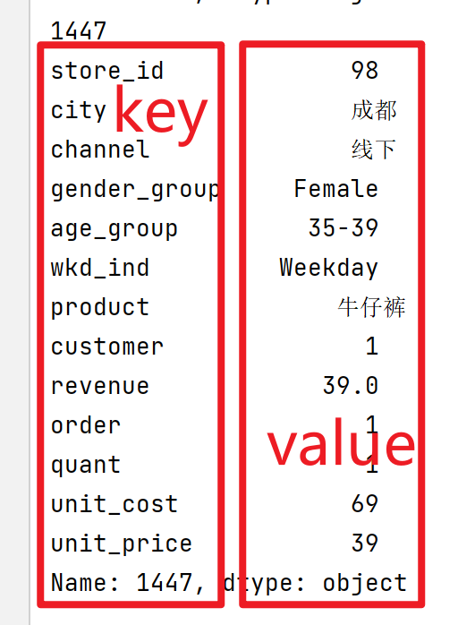
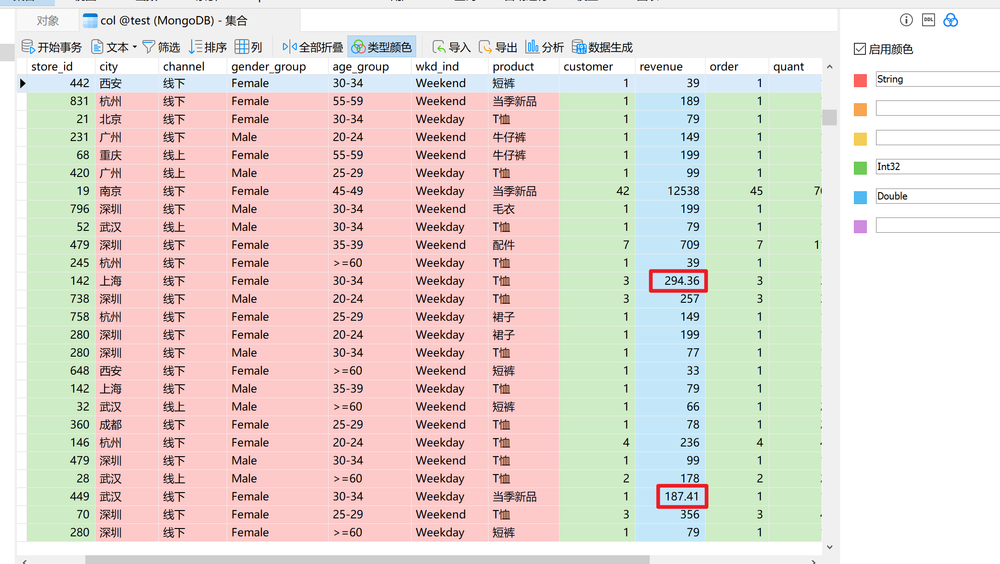
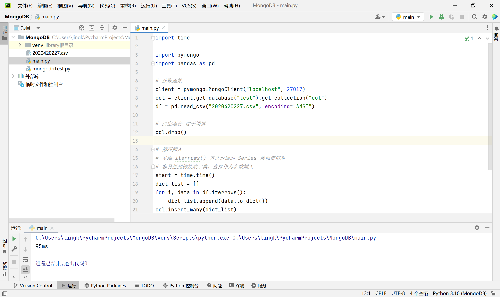
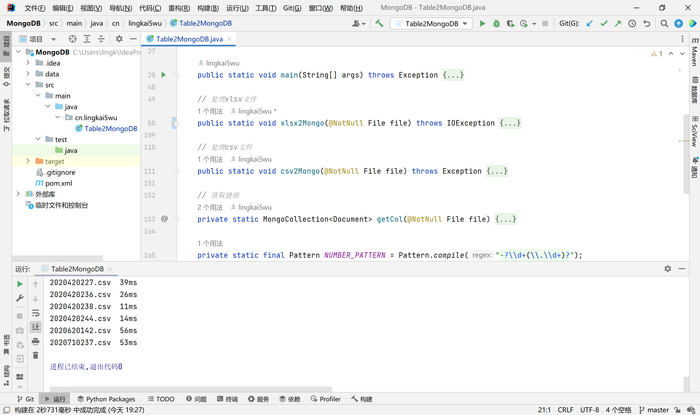
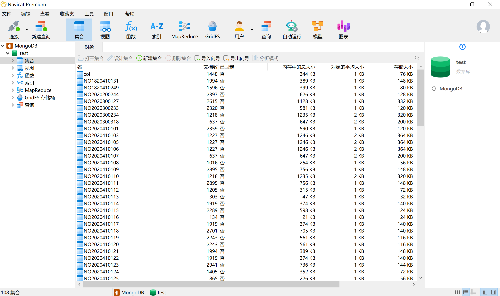
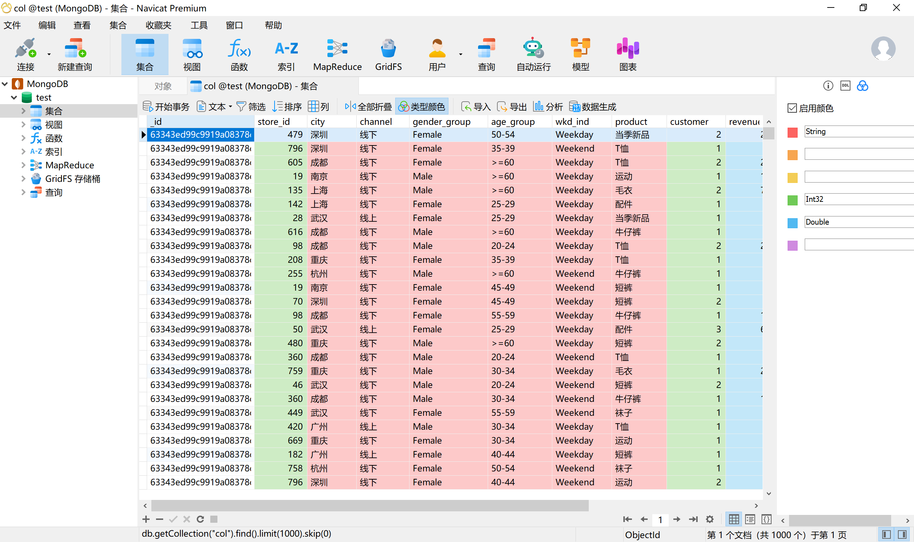
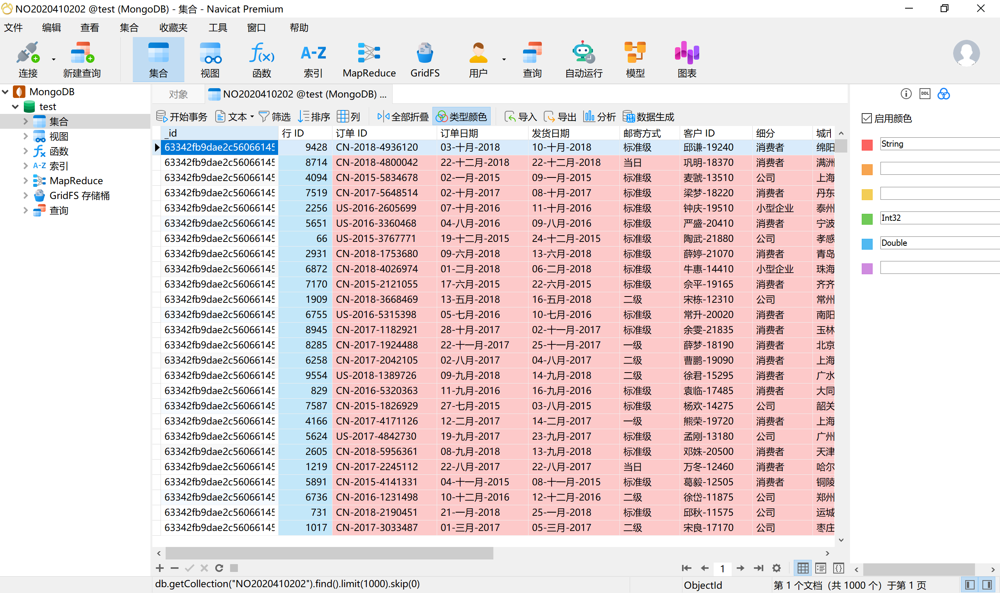

## 需求简介

使用Java或Python读取数据`CSV`文件，导入到`MongoBD`中，并可以进行读取等操作。

因为作业较为简单，我两个编程语言都实现，并给Java加了额外需求：导入全班所有的`CSV`文件。

## 主要完成过程

由于使用了两种编程语言，这里分开论述。

### Python

Python语法简单、模块众多，个人认为更合适解决这样架构简单、需求单一的问题，故优先尝试使用Python完成。

1. 简单学习`pandas`模块。
2. 尝试使用`pandas`模块读取`.csv`文件。

3. 搜索学习过程中发现`Pandas.DataFrame`的`iterrows()`方法能过返回行本身的对象`Series`，观察发现`Series`的输出形如Python字典的键值对。
   
4. 考虑`pymongo`模块的`insert_one()`方法实参也是字典，其中包含希望插入文档中的每个字段名和值。容易想到将`iterrows()`
   方法返回的对象转换为字典，作为`insert_one()`或`insertMany()`的实参。
5. 测试发现`Pandas.Series`有方法`to_dict()`能够实现需求，故将转换后的字典存入`List`。
6. 调用`insertMany()`全部插入。

考虑到Python代码量少，这里直接给出源码：

```python
import time

import pymongo
import pandas as pd

# 获取连接
client = pymongo.MongoClient("localhost", 27017)
col = client.get_database("test").get_collection("col")
df = pd.read_csv("2020420227.csv", encoding="ANSI")

# 清空集合 便于调试
col.drop()

start = time.time()
dict_list = []
# 遍历行迭代的结果
for i, data in df.iterrows():
    dict_list.append(data.to_dict())
col.insert_many(dict_list)
print("{}ms".format(round((time.time() - start) * 1000)))
```

### Java

Java作为高级程序设计语言，解决这样的问题自然不在话下，首先依老师提示的思路，即读取`Microsoft Office`格式档案。

方法名为`xlsx2Mongo()`。

1. 复习Java流相关知识。
2. 将`.csv`文件用`Excel`打开，另存为`.xlsx`文件。
3. 在`Maven`添加所需的`POI`依赖。
4. 将文件读入字节流，尝试读取`.xlsx`文件。
5. 使用`XSSF`读取首行，即字段名，存入数组。
6. 按行读取数据区域，构建`Document`，存入`List<Document>`。

7. 调用`insertMany()`全部插入。

调试后能够正常运行，但效率差强人意。猜测是`POI`迭代速度慢，故尝试直接对`CSV`文件处理。

方法名为`csv2Mongo()`。

1. 搜索Java读取`CSV`文件的方式，评估后选择第三方库`OpenCSV`。
2. 在`Maven`添加`OpenCSV`依赖。
3. 将文件读入字节流，再读入字符流。

4. 尝试使用`OpenCSV`模块读取首行和所有的数据区域，分别存入数组和`List<String>`。
5. 按行读取`List`，构建`Document`，存入`List<Document>`。

6. 调用`insertMany()`全部插入。

经多次测试，直接读取`CSV`文件较读取`Microsoft Office`格式文件的时间能缩短至少1/10。

后续增加了遍历文件，判断文件扩展名以调用相应的`xlsx2Mongo()`、`csv2Mongo()`方法，统计每个文件的处理时间等。

## 收获和不足

Python作为解释型、面向对象高级程序设计语言，代码复杂度低，拥有众多库函数和大量第三方库，在快速开发应用方面的优势是毋庸置疑的，这也是我作为Java方向还愿意自学Python的很大原因。这次的作业让我更加深刻体验到了Python简洁的魅力，试想Java需要数百行才能解决的需求，Python的核心代码甚至只有4行，即：

```python
dict_list = []
for i, data in df.iterrows():
    dict_list.append(data.to_dict())
col.insert_many(dict_list)
```

但Python也不是完美的，解释型语言的执行效率较低，相较于使用Java直接读取`CSV`
文件的方式，Python对同样的文件需要2倍的时间处理。Java的优势在于有商业化的容器、中间件、框架等，软件工程理念较强，这样单独的需求也许不足以展示Java。

对文件的处理是我未知的领域，虽然大二的《Java高级开发技术》有涉及到Java流相关知识，但更多的是停留在理论，并没有这样确切的需求去实现。本次的作业利用Python和Java分别实现了对`CSV`
文件和`Microsoft Office`格式档案的读取，大致掌握了对表格类文件处理的方法论，巩固了Java输入流基本类的使用方法，加深了对编码的认识。

在作业完成过程中，我真切体验到编程思想的重要性。从Python的灵机一动，将`pandas`
行迭代的结果转换为字典插入到数据库，再到Java提取方法，有意识的规划程序结构。想要编写可维护性高，可读性好的代码，需要在打好基础的前提下深入学习、理解编程思想。

愈学习，愈发现自己的无知。Python完成的十分梦幻，极高的抽象程度让你无需理解底层实现，莫名其妙就跑通了。很遗憾我目前的编程水平并不支持我完全理解Python的源码，还需要更多的学习。

这次作业我还发现我对Java流的掌握程度较低，如果不搜索可以说是无从下手，这是十分不应该的。我平时更偏向于算法，而忽略了对其他基础知识的学习。在今后的学习应更注实践，例如通过在做项目的过程中不断学习，全面提升自己的开发水平。

## 错误及改善

### 乱码/编码错误

Python的`pandas`、Java的字符流中都需要定义编码，否则将通过默认编码读入，若不对应会乱码。

Python可通过`Chardet`工具包，不过因为Python只读入一个文件，所以只通过人工判断编码。

Java则是参考了网络上的一段代码，通过文件开头的三个字符简单确定编码。

### Python执行过慢

首次完成Python使用的代码核心部分如下：

```python
for i, data in df.iterrows():
    col.insert_one(data.to_dict())
```

可以看出使用的是`insert_one()`方法，读一行插入一次。后续优化为`insertMany()`，同一个文件的运行时间从700ms降低到90ms左右。

### 导入数据格式问题

通过导入结果判断结合阅读源码，Python的`insert_one()`和`insertMany()`似乎会自动判断类型，如图：



浅绿色填充为`Int32`，浅红色填充为`String`，浅蓝色填充`Double`
。其中浅蓝色填充的字段仅有几个浮点数，但Python仍能将整列定义为`Double`，十分强大。

而Java调用`insertOne()`和`insertMany()`则是根据传入的实参类型来决定插入的类型。如果不加以限制，全部以字符串插入虽然可行，但必然造成空间的浪费。

经过评估，我最终选择了和`mongo shell`一样的逻辑，即数值类型定义为`Double`，非数值类型定义为`String`。

## 案例截图


Python部分源代码


Java部分源代码


Python和Java导入的集合（`col`集合为Python导入，`NO`开头的集合为Java导入）


Python导入的集合


Java导入的集合